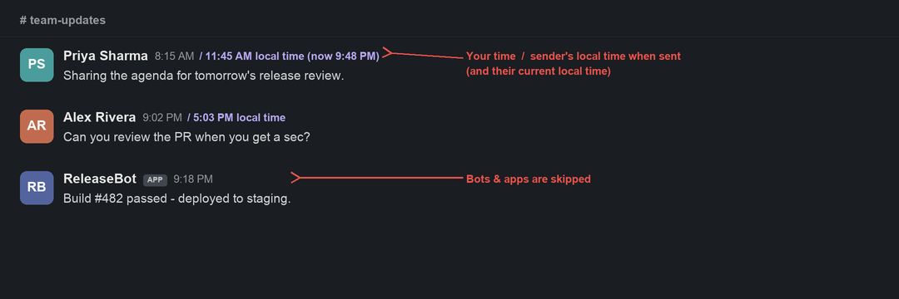
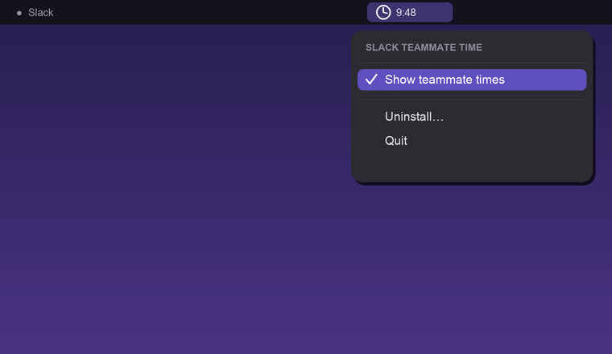

<div align="center">


# Slack Teammate Time

**See every teammate's local time right next to their name in Slack.**
A tiny, fully‑local macOS menu‑bar app. No login, no admin, no Marketplace app.

[](https://github.com/Gtarafdar/slack-teammate-local-time/releases/latest)
[](https://github.com/Gtarafdar/slack-teammate-local-time/releases)

-success)
[](LICENSE)
[](https://github.com/Gtarafdar/slack-teammate-local-time/stargazers)

**[⬇ Download the latest release](https://github.com/Gtarafdar/slack-teammate-local-time/releases/latest)** ·
**[🌐 Landing page](https://gtarafdar.github.io/slack-teammate-local-time/)** ·
**[⭐ Star](https://github.com/Gtarafdar/slack-teammate-local-time)**

`macOS 11+` · `Apple Silicon + Intel (universal)` · `Free & open source (MIT)` · `Runs fully on your Mac`

</div>

---



<div align="center"><em>Illustrative mockup with fictional names — not a real conversation.</em></div>

## What it does

Slack already knows everyone's local time — but it's tucked behind a profile
hover, and it slips your mind exactly when you need it. **Slack Teammate Time**
puts it right in the conversation: next to each person's name you see **their
local time**, computed live, so you instantly know *"is it a good time to ping
them?"* without opening a single profile.

- **Recent message** → the sender's **current** local time (e.g. `6:18 PM local time`).
- **Older message** → also their local time **when they sent it**, plus their
  current time (e.g. `11:45 AM local time (now 9:48 PM)`). Slack's own timestamp
  stays in *your* time, so you get all three at a glance.
- **Bots and apps** are skipped automatically — no clutter.

It reads the timezone Slack already exposes on profiles, using the Slack session
already on your Mac — so there's **nothing to log into and no workspace admin to
ask**. Slack itself is never modified.

## See it

| The menu bar toggle | Inline in Slack |
| --- | --- |
|  |  |

## Features

- **Inline local times** — each teammate's current local time next to their name,
  refreshed every minute.
- **Sent‑time + now** — older messages also show the sender's local time *when
  they sent it*, so timestamps make sense across timezones.
- **One‑click on/off** — a clock icon in your menu bar toggles the times **on or
  off instantly**. Slack updates live — no reload, no restart.
- **Bots & apps skipped** — automatically, so the message list stays clean.
- **No admin, no login, no Marketplace app** — it reuses the Slack desktop
  session already on your Mac. Works on personal and company workspaces alike.
- **Featherweight** — the background helper idles at ~15 MB RAM and is
  event‑light; the menu bar app is a tiny native binary.
- **Set & forget** — one‑time install, starts at login, runs continuously and
  restarts itself if needed. No daily relaunch, no Mac restart.
- **Universal & tidy** — one app for Apple Silicon and Intel, menu‑bar only (no
  Dock icon). Slack's look and feel is untouched.
- **Plug & play** — download a `.dmg`, double‑click the app, done. No code, no
  Terminal, no Node.js to install (it's bundled).

## How it works

```
menu bar app ──> writes state.json {"enabled": true|false}
launch-slack.sh ──> Slack (Electron) with --remote-debugging-port=9229 (localhost only)
injector.js (node) ──CDP──> injects inject.js into Slack's page
               └─> watches state.json ──> toggles labels live (no reload)
inject.js ──> reads in-page Slack token ──> /api/users.info ──> teammate timezone
          └─> MutationObserver adds the sender's local time next to each name
              (current time, plus their time-when-sent for older messages)
              and refreshes every minute
```

1. **Install & it self‑connects.** The bundled background helper attaches to the
   Slack desktop app locally over the Chrome DevTools Protocol (CDP) — bound to
   `127.0.0.1` only — and injects a small script into the page.
2. **It reads timezones from Slack itself.** Using the token already present in
   the page, it calls Slack's own same‑origin `users.info` API and caches each
   teammate's IANA timezone in `localStorage` for 12 hours.
3. **It renders inline, live.** A `MutationObserver` adds each sender's local
   time next to their name and refreshes every minute. The menu bar toggle just
   flips a boolean the helper watches — labels appear/disappear instantly.

### Why CDP injection (not patching Slack's `app.asar`)

The common "patch Slack's `app.asar`" trick breaks on the Mac App Store build
(sandboxed, code‑signed) and is wiped on every Slack update. Attaching over CDP
touches **nothing** inside the app, so it keeps working across updates and needs
no admin rights.

## Why I built this

Slack already knows everyone's local time — but it's hidden behind a profile
hover, and honestly it slips out of mind every single time. I'd do the mental
math wrong, or ping a teammate right in the middle of their evening.

I wanted that time **right there in the conversation**. But I didn't want to
bother a workspace admin to find or approve some app, and I didn't want to push
everyone onto a Marketplace app most of them would never need. So I built a tiny
thing for myself that just *shows* it — inline, quietly, **without breaking
Slack's aesthetic**.

It's especially handy for **remote teams** spread across timezones, where knowing
the exact local time is the difference between a welcome ping and a 2 AM buzz. It
runs **entirely on your own Mac**, needs **no admin and no login**, and it's
**free**. Because it's local‑only, there's no hassle and nothing to break on
anyone else's setup. If you've ever felt the same, it's yours too — share it with
whoever wants it.

## About the maker


**Gobinda Tarafdar** — WordPress product marketer by trade, stubborn
problem‑solver by habit, lifelong Harry Potter devotee by heart.

By day I'm the Product Marketing Specialist at **WPBakery** — the page builder
that quietly powers a sizeable corner of the WordPress universe. Before that, I
helped a single plugin cross **400,000+ active users** through positioning, user
research, and a relentless focus on what actually moves the needle. When the
day‑job owl flies home, I tinker on my own little workshop of spells — Slack
Teammate Time is one of them.

**Also from the workshop:**

- **[WPBakery](https://wpbakery.com/)** — the page builder I do product marketing for.
- **[Docscriber](https://thedocscriber.com/)** — documentation, conjured.
- **[TheRecaller](https://therecaller.com/)** — a memory charm for what you forget online.
- **[TheEditra](https://theeditra.com/)** — a video‑editing cauldron of my own brewing.
- **[The Quill Press](https://thequillpress.com/)** — tech news styled after the Daily Prophet.
- **[Costlas](https://costlas.com/)** — cost‑of‑living for 140 countries & 1,377 cities.

## ⭐ Rate it

If this saves you even one mistimed ping, a star means a lot — it's the simplest
way to say *"keep going,"* and it's how other people discover the app.

> **★ ★ ★ ★ ★** — one click on GitHub.

[](https://github.com/Gtarafdar/slack-teammate-local-time/stargazers)

## Support this project

If it saves you a hover, here's how to help — all optional, all appreciated:

- ⭐ **[Star it on GitHub](https://github.com/Gtarafdar/slack-teammate-local-time)** — helps others find it.
- ❤️ **[Donate](https://gtarafdar.com/donate)** — keeps the workshop lit.
- 🐦 **[Follow on X / Twitter](https://x.com/Gtarafdarr)**
- 💼 **[Connect on LinkedIn](https://www.linkedin.com/in/gobinda-tarafdar/)**

## Requirements

| | |
| --- | --- |
| **macOS** | 11.0 Big Sur or later |
| **Chip** | Apple Silicon or Intel (universal binary) |
| **Slack** | The native **Slack desktop app**, signed in (the browser version isn't covered) |
| **Download** | one `.dmg` · no Node.js or other prerequisites (bundled) |
| **Price** | Free & open source (MIT) |

## Install

1. **Download** [`SlackTeammateTime.dmg`](https://github.com/Gtarafdar/slack-teammate-local-time/releases/latest) from the latest release.
2. Open the `.dmg` and **double‑click the `SlackTeammateTime` app**.
3. **First launch only:** macOS will say it "can't be opened because Apple cannot
   check it for malware" — because the app is free and **unsigned** (see below).
   **Right‑click the app → Open → Open.** You only do this once.
4. Click **OK** in the install dialog.

That's it — a **clock icon appears in your menu bar**, Slack shows teammate times,
and it starts automatically at every login.

> **Why the Gatekeeper prompt?** Opening a Mac app with a plain double‑click
> requires a paid Apple Developer signature ($99/yr). This app is free and
> **unsigned**, so macOS asks you to confirm once via right‑click → Open. After
> that first time it opens normally. Nothing about the app changes either way.

### Turning it on/off (menu bar)

Click the **clock icon in the menu bar**:

- **Show teammate times** — toggle the inline times **on/off instantly** (live, no
  reload).
- **Uninstall…** — completely removes the helper and its login item. Slack itself
  is never touched.
- **Quit** — closes the menu bar app for this session (it returns at next login).

## Security & privacy

Your Slack session is sensitive, so this is built to stay **local and safe**. It
was put through an automated security review with **no critical, high, or medium
findings**, plus defensive hardening.

- **Nothing leaves your Mac.** The injected script talks only to Slack's
  **same‑origin** API (the same thing the official client does) to read
  timezones. No analytics, no telemetry, no third‑party servers.
- **Your token never leaves Slack's origin.** It's read from the page and only
  POSTed to same‑origin `/api/users.info` — never logged, never written to disk,
  never sent anywhere else.
- **No XSS.** All injected text uses `textContent` (never `innerHTML`), so
  API/profile data can't execute as markup.
- **Debug port is localhost‑only.** Chromium binds `--remote-debugging-port` to
  `127.0.0.1` and we set `--remote-allow-origins` to a single specific origin
  (not `*`), which blocks remote sites and DNS‑rebinding.
- **The toggle carries no code.** The menu only writes a boolean to `state.json`;
  the helper reads just that boolean — it never evaluates the file's contents.
- **Locked‑down runtime.** The deployed copy in
  `~/Library/Application Support/SlackTeammateTime` is user‑only (`700`).
- **No elevated privileges.** Everything runs as your user — no `sudo`, no setuid,
  and Slack itself is never modified.

### How we ran the security check

1. **Dependency scan** — `npm audit` (**0 vulnerabilities**). Re‑run with `npm audit`.
2. **Manual code review** of every file: CDP attack surface, token handling, the
   same‑origin API call, DOM/XSS safety, the shell scripts / LaunchAgents, and the
   menu bar app + its state file.
3. **Static checks** — `bash -n` on scripts, `node --check` on JS,
   `plutil -lint` on plists, `codesign --verify` on the built app.

### Residual risk (by design)

Enabling the CDP port gives full control of your Slack session to **anything that
can connect to it**. We restrict it to localhost + one allowed origin, which stops
remote/web attackers — but another program already running on your Mac **as you**
could connect too. This is inherent to any CDP‑based approach; a local attacker
with code execution as your user can generally already reach your data. If that's
unacceptable for your threat model, use it on demand and Uninstall when done.

> This is an unofficial, local enhancement. It only reads timezone info Slack
> already shows on profiles. Modifying client behavior is technically outside
> Slack's ToS — use at your discretion.

## FAQ

**Does it work on the Slack mobile app?**
Not with this approach — and that's a deliberate trade‑off. The whole point is
*no login, no admin, no installed Slack app*. Mobile Slack is a native, sandboxed
app that can't be extended without either jailbreaking your phone or building an
approved Slack app/bot (which needs workspace‑admin approval — exactly what we're
avoiding). The good news: Slack **already** shows a person's local time on their
profile on mobile (tap their name). This tool is about removing that extra tap on
the **desktop**, where you do most of your typing.

**Will a Slack update break it?**
It attaches over CDP and never modifies Slack, so it survives Slack auto‑updates.
Slack's DOM class names are obfuscated and can change; if a future update moves
things, the selectors at the top of `inject.js` (`SELECTORS`) are easy to adjust.

**Do I need to keep a Terminal open / restart it daily?**
No. It installs a per‑user login agent that runs continuously and restarts the
helper automatically. Install once and forget it.

**Is it really free?** Yes — free and open source under the MIT license.

## Build from source

Requires the Xcode toolchain (for the universal menu bar binary) and Node (only to
bundle dependencies — end users need nothing).

```bash
./build-mac-app.sh   # downloads Node (arm64 + x64), compiles a universal app, builds the .dmg
```

Outputs `dist/SlackTeammateTime.app` (universal, ad‑hoc signed) and
`dist/SlackTeammateTime.dmg`. On first launch the app copies itself to
`~/Applications`, deploys the background engine, and registers a login item.

### Distribution / removing the Gatekeeper prompt

Ad‑hoc signing works for personal use. To share without the one‑time
right‑click → Open, sign with a Developer ID certificate and notarize:

```bash
codesign --force --deep --options runtime --sign "Developer ID Application: NAME (TEAMID)" "dist/SlackTeammateTime.app"
ditto -c -k --keepParent "dist/SlackTeammateTime.app" SlackTeammateTime.zip
xcrun notarytool submit SlackTeammateTime.zip --apple-id you@example.com --team-id TEAMID --password APP_SPECIFIC_PW --wait
xcrun stapler staple "dist/SlackTeammateTime.app"
```

## Project layout

| Path | Purpose |
| --- | --- |
| `app/SlackTeammateTime.swift` | The menu bar app (toggle, install/uninstall, login item). |
| `app/setup.sh` | Silent, arch‑aware engine deploy/uninstall used by the app. |
| `app/Info.plist`, `app/AppIcon.icns` | App bundle metadata and icon. |
| `build-mac-app.sh` | Builds the universal `.app` + `.dmg`. |
| `injector.js` | Node daemon: attaches to Slack via CDP, injects the script, watches the on/off state. |
| `inject.js` | The in‑page script (timezone lookup + inline labels + minute refresh + live toggle). |
| `launch-slack.sh` | Relaunches Slack with the debug + allow‑origins flags. |
| `run.sh` | Ensures Slack is up with the port, then runs the injector (used by the login agent). |
| `install-agent.sh` / `uninstall-agent.sh` | Install / remove the login auto‑start (developer flow). |
| `docs/` | GitHub Pages landing page and images. |

## Manual timezone overrides

If the API can't resolve someone, edit `inject.js` and add their Slack user id to
`OVERRIDES` with an IANA timezone:

```js
OVERRIDES: {
  'U09667NPTUN': 'Europe/Belgrade',
},
```

Reload Slack (Cmd+R) to apply. If installed via the app, re‑run the installer (or
`./install-agent.sh`) to redeploy the edited file.

## Troubleshooting

- **No times appear:** make sure Slack was launched with the debug port. Confirm
  with `curl -s http://127.0.0.1:9229/json/version`. The login agent handles this
  automatically; if you opened Slack manually, the agent relaunches it.
- **A teammate shows no time:** they may have no timezone set in Slack, or be a
  bot/app (skipped). Use `OVERRIDES` to force one.
- **Times look stale:** they refresh every 60s; reopening the conversation also
  refreshes immediately.

## License

MIT © Gobinda Tarafdar. See [LICENSE](LICENSE).

---

<div align="center">

Slack is a trademark of Slack Technologies. This project is independent and
unofficial, runs fully on your Mac, and only reads timezone information Slack
already shows on profiles.

</div>
